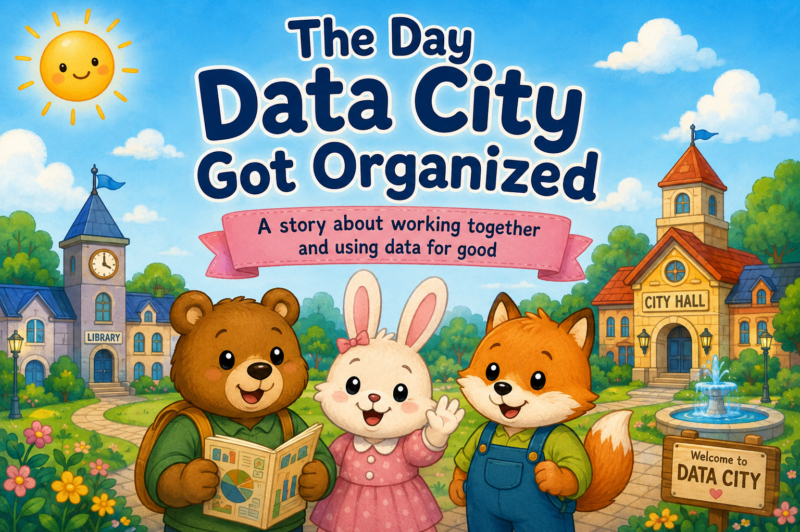
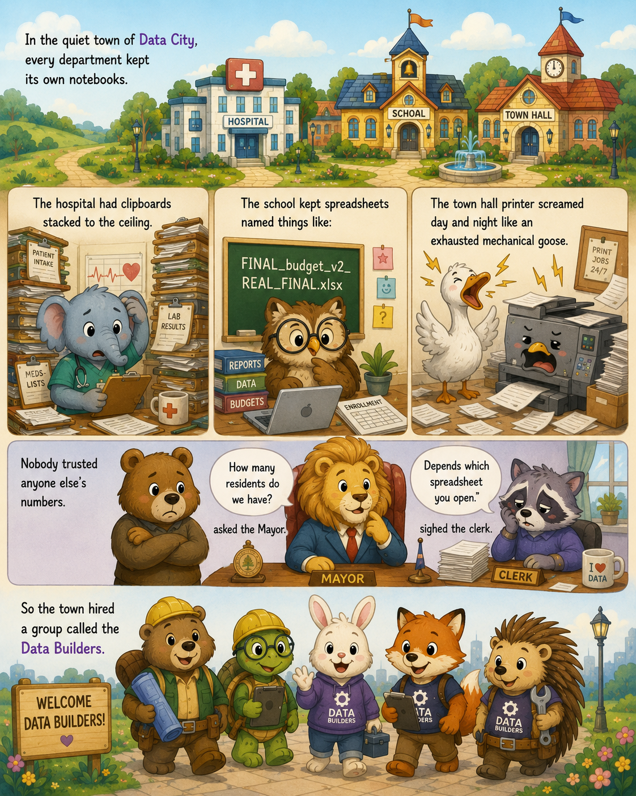
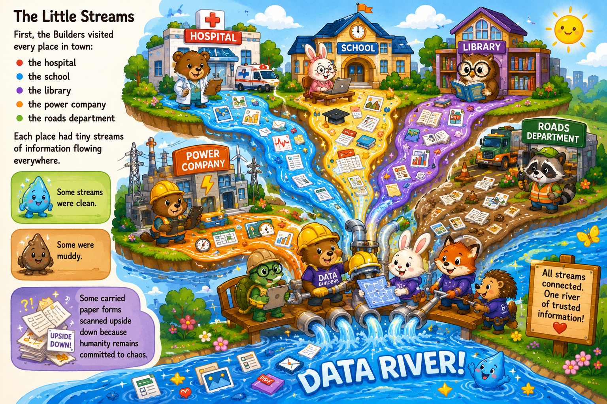
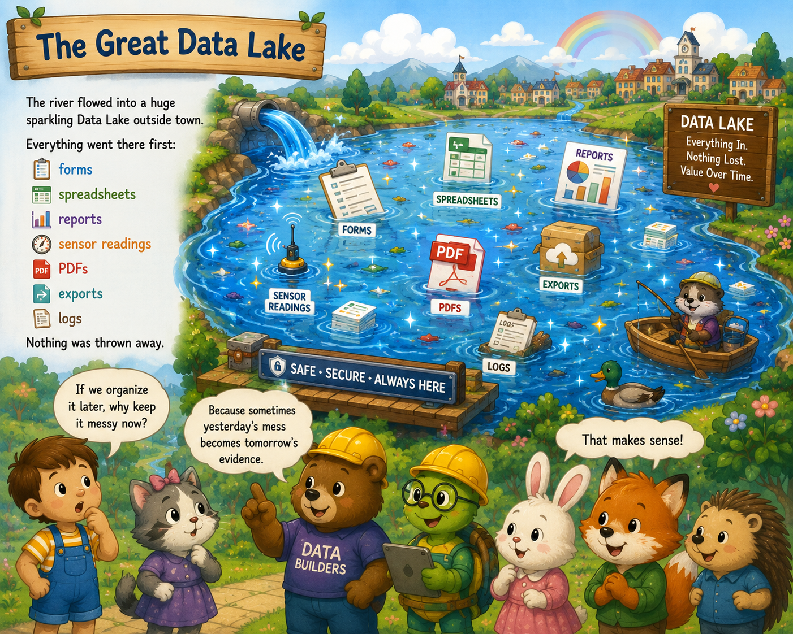
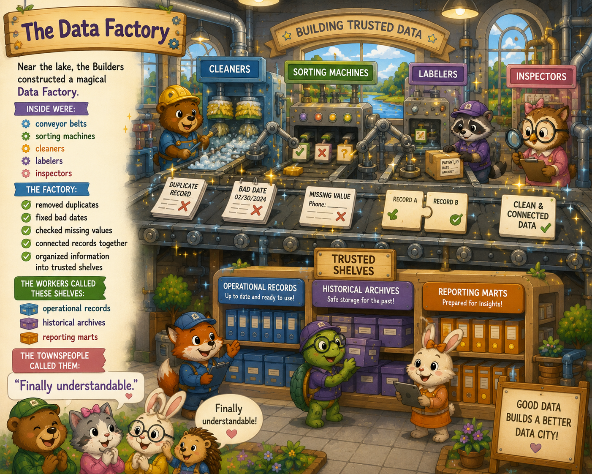
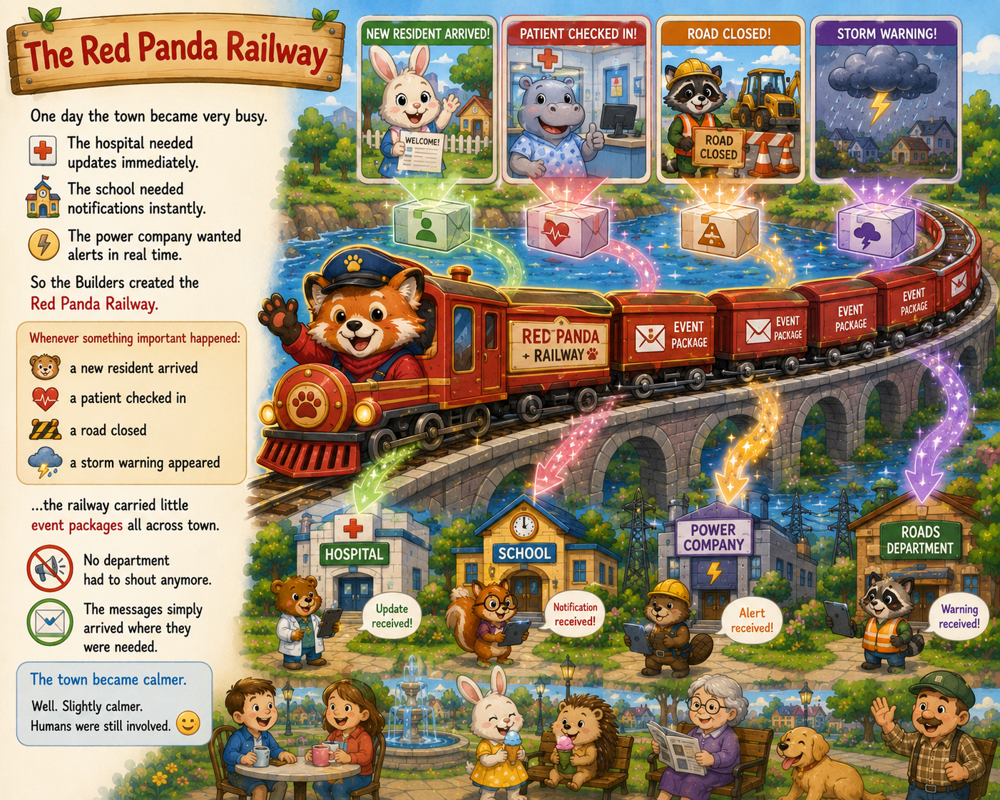
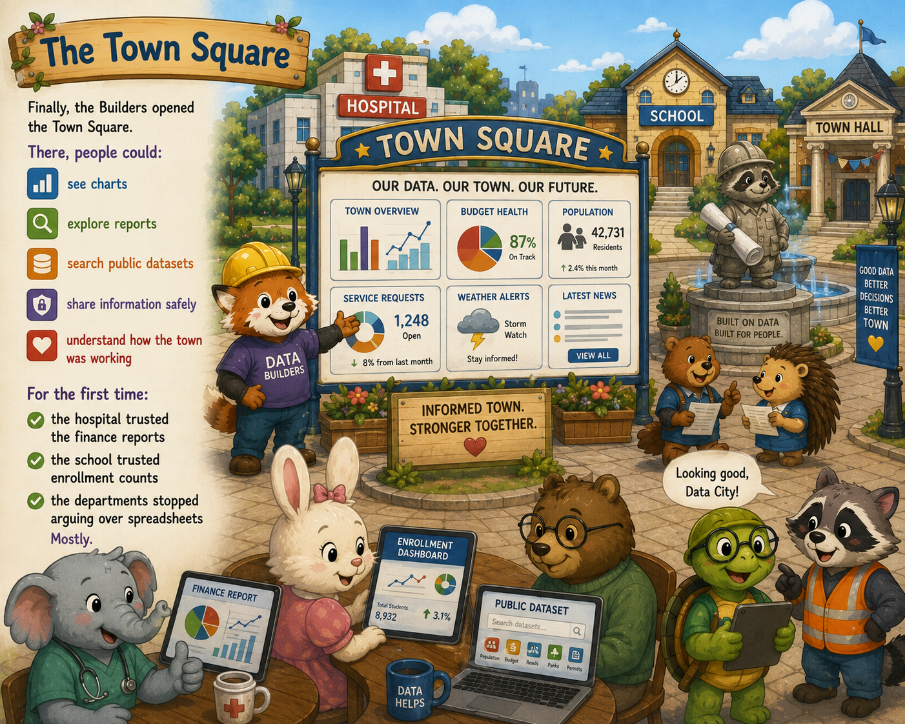
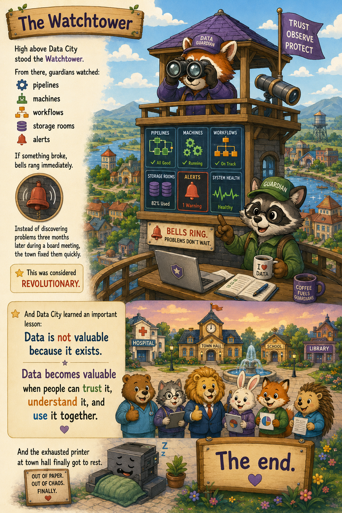

# The Day Data City Got Organized



In the quiet town of Data City, every department kept its own notebooks.

The hospital had clipboards stacked to the ceiling.

The school kept spreadsheets named things like:

```text
FINAL_budget_v2_REAL_FINAL.xlsx
```

The town hall printer screamed day and night like an exhausted mechanical goose.

Nobody trusted anyone else's numbers.

"How many residents do we have?" asked the Mayor.

"Depends which spreadsheet you open," sighed the clerk.

So the town hired a group called the Data Builders.



## The Little Streams

First, the Builders visited every place in town:

- the hospital
- the school
- the library
- the power company
- the roads department

Each place had tiny streams of information flowing everywhere.

Some streams were clean.

Some were muddy.

Some carried paper forms scanned upside down because humanity remains committed to chaos.

The Builders connected the streams into a giant Data River.



## The Great Data Lake

The river flowed into a huge sparkling Data Lake outside town.

Everything went there first:

- forms
- spreadsheets
- reports
- sensor readings
- PDFs
- exports
- logs

Nothing was thrown away.

"If we organize it later, why keep it messy now?" asked a child.

"Because sometimes yesterday's mess becomes tomorrow's evidence," replied the Builders.

The townspeople nodded, pretending they had always understood that.



## The Data Factory

Near the lake, the Builders constructed a magical Data Factory.

Inside were:

- conveyor belts
- sorting machines
- cleaners
- labelers
- inspectors

The factory:

- removed duplicates
- fixed bad dates
- checked missing values
- connected records together
- organized information into trusted shelves

The workers called these shelves:

- operational records
- historical archives
- reporting marts

The townspeople called them:

"Finally understandable."



## The Red Panda Railway

One day the town became very busy.

The hospital needed updates immediately.

The school needed notifications instantly.

The power company wanted alerts in real time.

So the Builders created the Red Panda Railway.

Whenever something important happened:

- a new resident arrived
- a patient checked in
- a road closed
- a storm warning appeared

...the railway carried little event packages all across town.

No department had to shout anymore.

The messages simply arrived where they were needed.

The town became calmer.

Well. Slightly calmer. Humans were still involved.



## The Hall of Maps and Meanings

Next, the Builders opened the Hall of Maps and Meanings.

Inside were giant maps showing:

- where data came from
- who owned it
- how it changed
- which reports used it

"If this number is wrong," asked the Mayor, "can we trace where it started?"

"Yes," said the Builders.

The Mayor nearly fainted from excitement.

No one had ever answered that question before.


## The Town Square

Finally, the Builders opened the Town Square.

There, people could:

- see charts
- explore reports
- search public datasets
- share information safely
- understand how the town was working

For the first time:

- the hospital trusted the finance reports
- the school trusted enrollment counts
- the departments stopped arguing over spreadsheets

Mostly.



## The Watchtower

High above Data City stood the Watchtower.

From there, guardians watched:

- pipelines
- machines
- workflows
- storage rooms
- alerts

If something broke, bells rang immediately.

Instead of discovering problems three months later during a board meeting, the town fixed them quickly.

This was considered revolutionary.



And Data City learned an important lesson:

Data is not valuable because it exists.

Data becomes valuable when people can trust it, understand it, and use it together.

And the exhausted printer at town hall finally got to rest.

The end.
