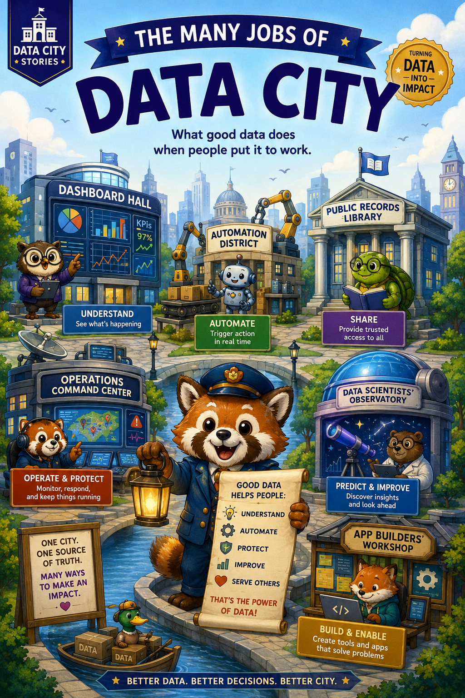
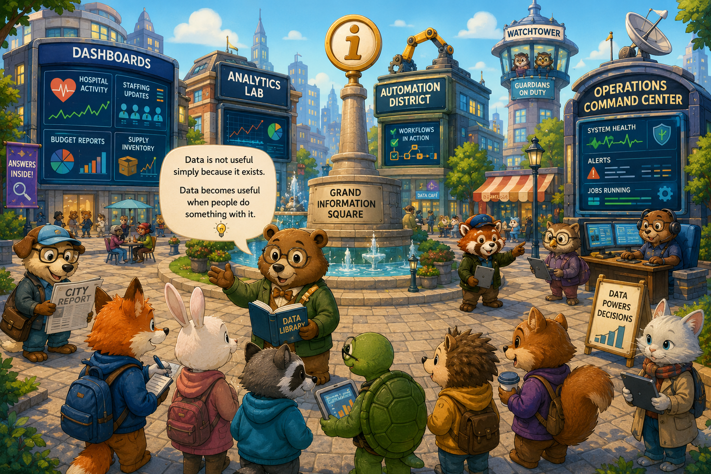
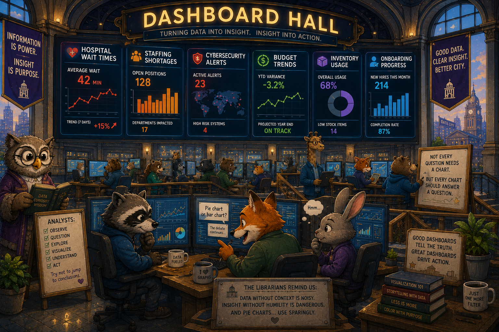
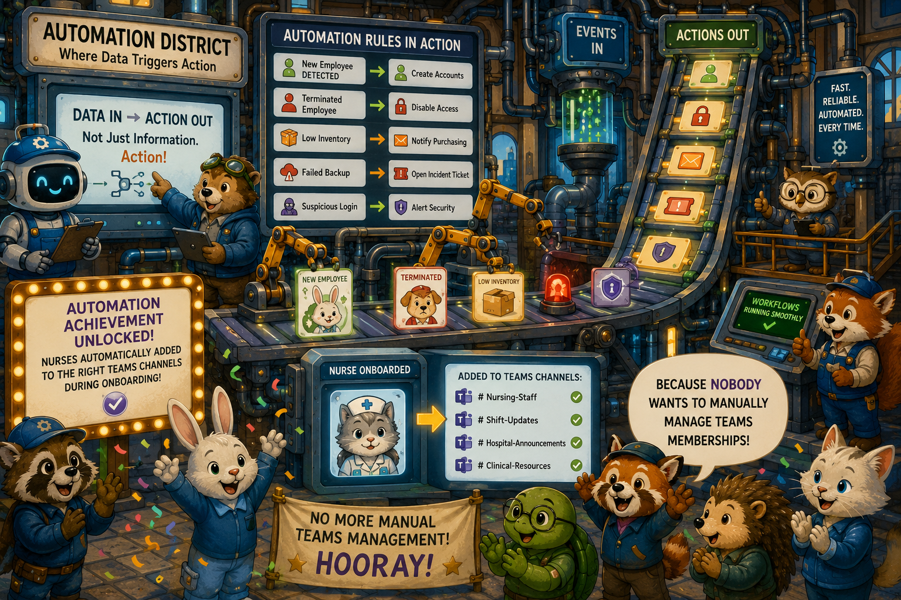
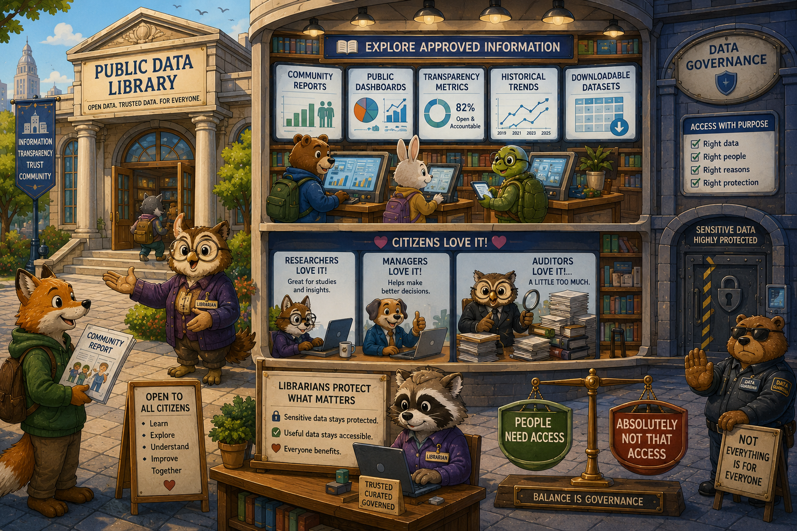
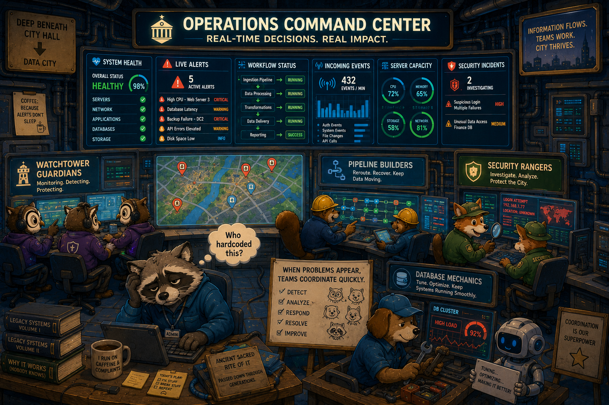
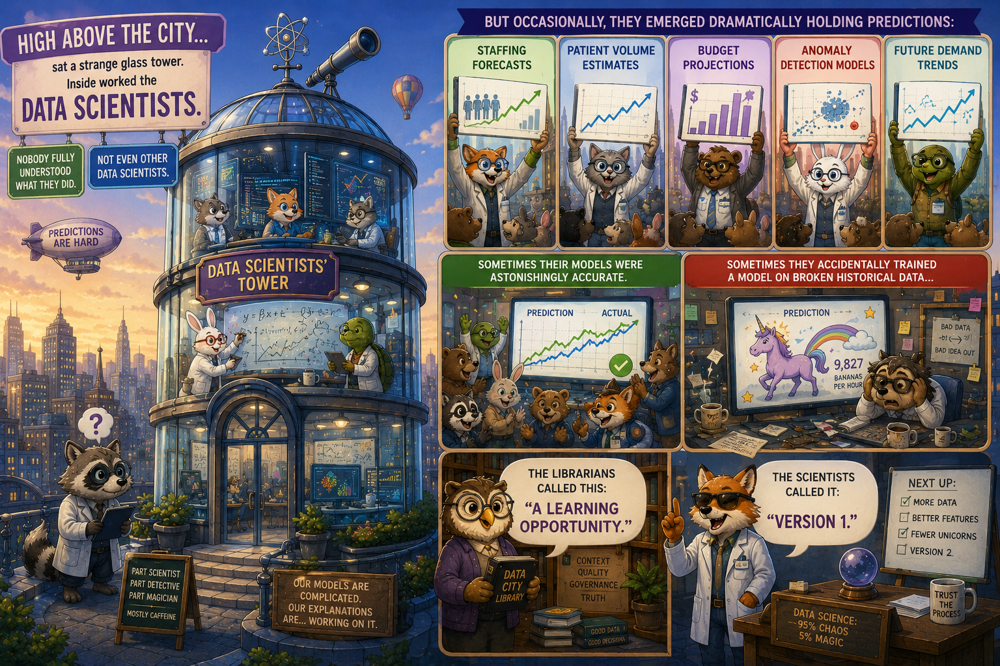
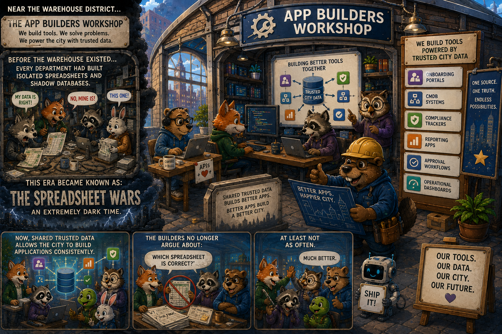
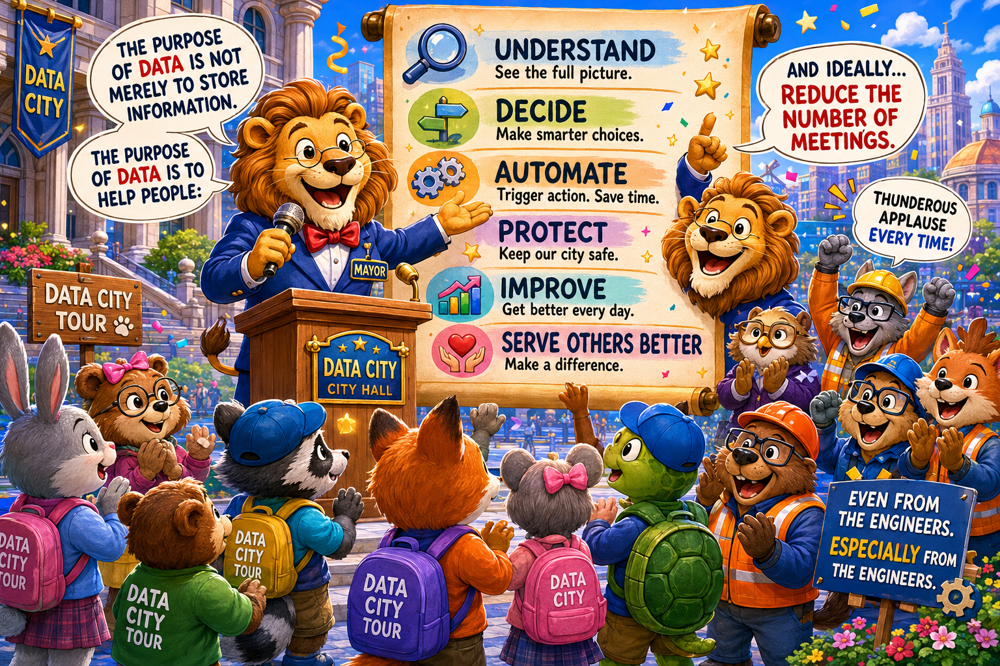

# The Many Jobs of Data City

Publishing, analytics, automation, and operations story.

Every morning in Data City, thousands of people visited the Grand Information Square.

But they did not all come for the same reason.

Because data, the Librarians explained, was not useful simply because it existed.

Data became useful when people did something with it.

A concept humans continuously rediscover every five years with new buzzwords and larger consulting invoices.

## The Dashboard Hall

The first stop for many citizens was the Dashboard Hall.

Huge glowing screens covered the walls:

- hospital wait times
- staffing shortages
- cybersecurity alerts
- budget trends
- inventory usage
- onboarding progress

The Analysts studied charts carefully.

Sometimes they discovered important problems.

Sometimes they spent forty minutes debating whether a pie chart should have been a bar graph.

The Librarians tried not to judge.

## The Automation District

Meanwhile, across town, the Automation Engineers worked tirelessly.

They believed data should not just inform people.

It should trigger action automatically.

So they built machines that reacted instantly:

- new employee detected -> create accounts
- terminated employee -> disable access
- low inventory -> notify purchasing
- failed backup -> open incident ticket
- suspicious login -> alert security

One famous machine automatically added nurses to the correct Teams channels during onboarding.

The city celebrated this achievement enthusiastically.

Mostly because nobody wanted to manually manage Teams memberships anymore.

## The Public Records Library

In another district stood the Public Data Library.

Citizens could walk in freely and browse approved information:

- community reports
- public dashboards
- transparency metrics
- historical trends
- downloadable datasets

Researchers loved it.

Managers loved it.

Auditors loved it a little too much.

The Librarians ensured sensitive information stayed protected while useful information remained accessible.

Because governance in Data City meant balancing:

"People need access"

with

"Absolutely not THAT access."

## The Operations Command Center

Deep beneath City Hall sat the Operations Command Center.

This was where real-time decisions happened.

Large maps displayed:

- system health
- live alerts
- workflow status
- incoming events
- server capacity
- security incidents

When problems appeared, teams coordinated quickly.

The Watchtower Guardians monitored alerts.

The Pipeline Builders rerouted traffic.

The Security Rangers investigated suspicious activity.

The Database Mechanics tuned overloaded systems.

And somewhere nearby, a tired administrator muttered:

"Who hardcoded this?"

A phrase historians later identified as one of the ancient sacred rites of IT.

## The Data Scientists' Observatory

High above the city sat a strange glass tower.

Inside worked the Data Scientists.

Nobody fully understood what they did.

Not even other Data Scientists.

But occasionally they emerged dramatically holding predictions:

- staffing forecasts
- patient volume estimates
- budget projections
- anomaly detection models
- future demand trends

Sometimes their models were astonishingly accurate.

Sometimes they accidentally trained a model on broken historical data and predicted absurd nonsense.

The Librarians called this:

"A learning opportunity."

The Scientists called it:

"Version 1."

## The App Builders Workshop

Near the Warehouse District sat the App Builders Workshop.

Here, developers created specialized tools powered by trusted city data:

- onboarding portals
- CMDB systems
- compliance trackers
- reporting apps
- approval workflows
- operational dashboards

Before the Warehouse existed, every department had built isolated spreadsheets and shadow databases.

This era became known as:

The Spreadsheet Wars.

An extremely dark time.

Now, shared trusted data allowed the city to build applications consistently.

The Builders no longer argued about:

"Which spreadsheet is correct?"

At least not as often.

## The Lesson of Data City

At the end of each school year, children visited the city for a tour.

The mayor always ended with the same speech:

"The purpose of data is not merely to store information.

The purpose of data is to help people:

understand,
decide,
automate,
protect,
improve,
and serve others better."

Then the mayor quietly added:

"And ideally reduce the number of meetings."

Thunderous applause followed every time.

Even from the engineers.

Especially from the engineers.

